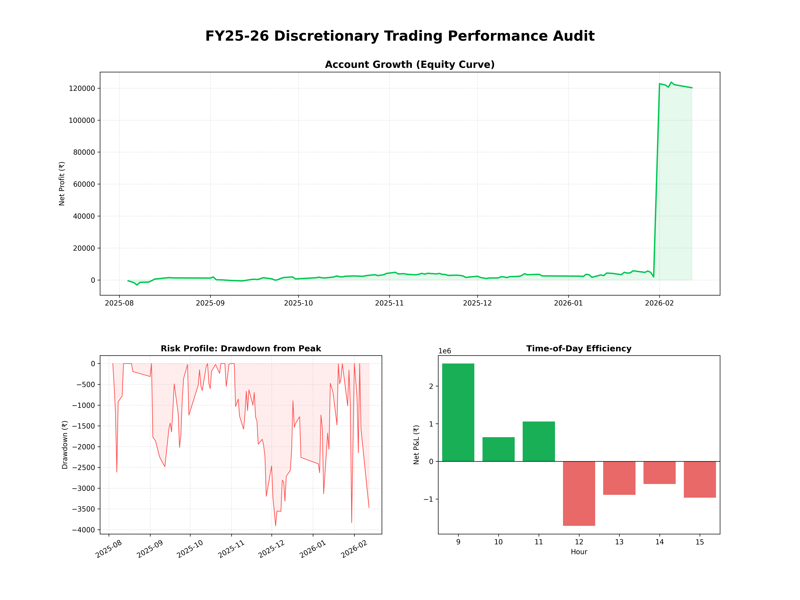

# Quantitative Audit: Discretionary F&O Strategy (FY25-26)

### 📊 Executive Summary
This repository contains a performance audit of my discretionary trading activity for the Fiscal Year 2025-26. 
The analysis leverages Python to evaluate risk-adjusted returns, execution efficiency, and "fat-tail" risk across **4,182 real-money trades**.

* **Reporting Period:** August 1, 2025 – February 16, 2026
* **Asset Class:** Equity Derivatives (F&O) & Intraday Equity
* **Total Volume:** ~4,182 Executions (FY25-26) | ~8,800+ Trades (Last 2 Years)

### 🚀 Performance Metrics (Audit Sample)
| Metric | Value | Analysis |
| :--- | :--- | :--- |
| **Net Profit (Realized)** | **₹1,20,290** | Consistent profitability over the 6.5-month audit window. |
| **Profit Factor** | **4.53** | **Elite Tier.** For every ₹1 lost, the strategy generates ₹4.53 in profit. |
| **Win Rate** | **47.2%** | Validates a "Trend Following" approach (lower accuracy, massive payouts). |
| **Risk/Reward Ratio** | **1 : 5.08** | Average winner (₹3,087) is >5x larger than average loser (₹608). |
| **Max Drawdown** | **< ₹4,000** | Peak-to-trough decline was strictly controlled, never exceeding 4% of net profits. |

### 📈 Performance Dashboard
*(Visualization of Equity Curve, Drawdown, and Hourly Efficiency generated via `audit_script.py`)*

### 🛠️ Trading Infrastructure & Tech Stack
My approach combines institutional-grade execution tools with custom quantitative analysis.

* **Execution Platforms:** FoxNet, TX3, TradeTiger
* **Charting & Alpha Generation:** TradingView (Custom Pine Script indicators), Python (Post-trade analysis)
* **Brokers:** Dhan (API Data Source)

### 🧠 Strategy Insights
1.  **Asymmetric Risk Profile:** The strategy does not rely on high accuracy (47% Win Rate). It relies on identifying high-conviction setups where the Reward-to-Risk ratio exceeds 1:4.
2.  **Time-Decay Edge:** Quantitative analysis revealed a massive edge in the **Morning Session (9:15 AM – 12:00 PM)**. As a result, position sizing is programmatically reduced by 50% after 12:30 PM to preserve alpha.
3.  **Algorithmic Discipline:** While execution is discretionary, risk management is systematic. The **Drawdown Chart** (Bottom Left) confirms that losses are cut rapidly, preventing capital erosion.

---
*Verified by Ledger Data: August 2025 - February 2026*
